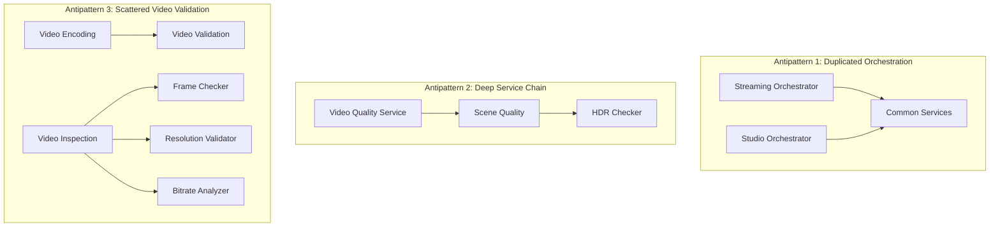

## Prompt:
You are an IT Architect specializing in microservice architectures. Your task is to analyze the attached PlantUML and OpenAPI files to identify architectural antipatterns. Follow a detailed step-by-step analysis: 1. Understand the Context: Provide a high-level summary of the architecture's structure and purpose. 2. Analyze Dependencies: Identify how services interact and depend on each other. 3. Identify Antipatterns: List potential antipatterns and explain why they apply. 4. List each antipattern with the following details \* T\*he name of the antipattern. \* \*A concise explanation of how it manifests in the architecture. \* A\* proposed solution to address the issue. \* Example: **Antipattern 1: Chatty Service** **Manifestation:** The Payment Service (PS) makes multiple calls to the LedgerStore (LS) in quick succession: - Lookup Hold - Check Hold Status - Retrieve Hold Details - Verify Hold Amount **Proposed Solution:** - Use a bulk request approach or a composite API pattern. Instead of multiple calls, PS can request all necessary details in one API call, e.g., `LS: GetHoldDetails`. - Introduce a caching mechanism to avoid repeated lookups for data that does not frequently change.

## Response:
I'll analyze the Netflix video processing architecture following the requested steps.

1.  Understanding the Context: This appears to be a video processing pipeline architecture for Netflix, consisting of two main workflow orchestrators (Streaming and Studio) that coordinate various specialized services for video processing, including:

*   Video encoding and validation
*   Audio processing
*   Subtitle handling
*   Quality analysis
*   Format packaging
*   Bitrate and resolution management

2.  Analyzing Dependencies: Let me analyze the key dependency patterns:

*   Both orchestrators (Streaming and Studio) have parallel dependencies on core services
*   The Complex Analysis Service feeds into both video encoding and quality services
*   Video Quality Service has a hierarchical dependency structure with multiple analyzers
*   The Ladder service coordinates with multiple generators and validators

3.  Identifying Antipatterns:

**Antipattern 1: Duplicated Orchestration**

*   **Manifestation:** The architecture shows two separate workflow orchestrators (Streaming and Studio) that connect to the same set of underlying services. This creates potential issues with:
    *   Duplicated business logic
    *   Inconsistent handling of workflows
    *   Increased maintenance overhead
*   **Proposed Solution:**
    *   Implement a single unified workflow orchestrator
    *   Use configuration-driven workflows to handle different use cases
    *   Implement a facade pattern to abstract common functionality

**Antipattern 2: Deep Service Chain**

*   **Manifestation:** The video quality analysis shows a deep chain of service dependencies: Video Quality Service → Scene Quality → HDR Checker This creates:
    *   Increased latency
    *   Higher risk of cascade failures
    *   Tight coupling between services
*   **Proposed Solution:**
    *   Implement parallel processing where possible
    *   Use event-driven architecture for quality checks
    *   Implement circuit breakers and bulkheads
    *   Consider merging closely related quality services

**Antipattern 3: Scattered Video Validation**

*   **Manifestation:** Video validation logic is spread across multiple services:
    *   Video Validation Service
    *   Frame Integrity Checker
    *   Resolution Validator
    *   Bitrate Analyzer This leads to:
    *   Fragmented validation logic
    *   Potential inconsistencies
    *   Difficult maintenance
*   **Proposed Solution:**
    *   Create a unified Video Validation Service
    *   Implement a validation pipeline pattern
    *   Use a shared validation rule engine
    *   Maintain centralized validation policies

**Antipattern 4: Encoder Sprawl**

*   **Manifestation:** Multiple encoding services (H.264, H.265, AV1) are directly connected to the Video Encoding Service, creating:
    *   Complex routing logic
    *   Difficult version management
    *   Potential inconsistencies in encoding approaches
*   **Proposed Solution:**
    *   Implement an Encoder Factory pattern
    *   Use a strategy pattern for encoder selection
    *   Create an encoder abstraction layer
    *   Implement unified monitoring and metrics

**Antipattern 5: Missing Resilience Patterns**

*   **Manifestation:** The architecture doesn't show explicit patterns for:
    *   Service discovery
    *   Circuit breaking
    *   Retry logic
    *   Load balancing
*   **Proposed Solution:**
    *   Implement service mesh patterns
    *   Add retry and circuit breaker patterns
    *   Implement proper health checking
    *   Add load balancing and failover capabilities

Would you like me to elaborate on any of these antipatterns or discuss additional architectural improvements?

