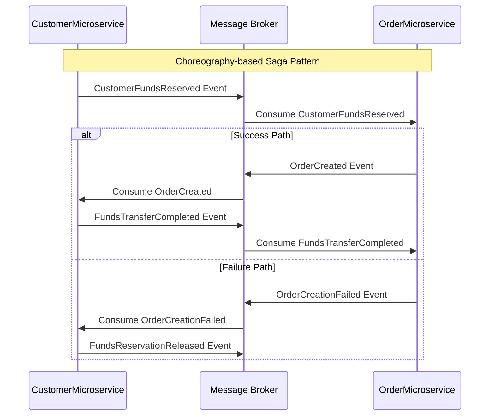

## Prompt:
You are an experienced IT Architect specializing in microservice architectures. Your task is to analyze the attached PlantUML and OpenAPI files to identify architectural antipatterns. For each antipattern found, provide: The name of the antipattern. A concise explanation of how it manifests in the architecture. A proposed solution to address the issue.

## Response:
Let me analyze this two-phase commit (2PC) sequence diagram from an architectural perspective and identify the antipatterns.

1.  **Distributed Transaction Antipattern**
    *   Manifestation: The architecture implements a distributed transaction across microservices using a 2PC protocol, as shown by the coordinated locking and commit sequence between CustomerMicroservice and OrderMicroservice.
    *   Problem: 2PC introduces tight coupling between services and can lead to scalability issues, reduced availability, and potential deadlocks. If any service fails during the commit phase, the entire transaction is blocked.
    *   Solution: Implement an event-driven architecture using the Saga pattern. Break the distributed transaction into a series of local transactions, each published as an event. If a step fails, execute compensating transactions to maintain consistency.
2.  **Temporal Coupling Antipattern**
    *   Manifestation: The sequence shows synchronous communication where the Coordinator waits for responses from each service before proceeding (visible in the request-response pattern throughout the diagram).
    *   Problem: This creates a temporal dependency where all services must be available simultaneously, reducing system resilience and increasing latency.
    *   Solution: Implement asynchronous communication patterns using message queues or event streams. Services can process requests independently and communicate their status through events, improving system resilience and scalability.
3.  **Orchestration Over Choreography Antipattern**
    *   Manifestation: The Coordinator acts as a central orchestrator, explicitly directing every step of the process and maintaining transaction state.
    *   Problem: This creates a single point of failure and bottleneck, while also increasing coupling between services.
    *   Solution: Use choreography where services react to events from other services. For example, when CustomerMicroservice completes the fund lock, it could publish an event that OrderMicroservice subscribes to, triggering the order creation without central coordination.

A high-level solution could look like this:

This proposed solution:

*   Eliminates the need for distributed transactions
*   Removes the central coordinator
*   Allows services to operate independently
*   Maintains eventual consistency through compensating transactions
*   Improves system resilience and scalability

Would you like me to elaborate on any of these antipatterns or the proposed solution?

