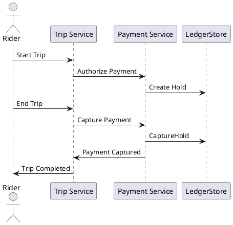

## Prompt:
You are an experienced IT Architect specializing in microservice architectures. Your task is to analyze the attached PlantUML and OpenAPI files to identify architectural antipatterns. For each antipattern found, provide:

The name of the antipattern.
A concise explanation of how it manifests in the architecture.
A proposed solution to address the issue.

## Response:
The primary anti-pattern evident in the provided PlantUML is the **Chatty Service Anti-pattern**.

**How it manifests:** The Payment Service (PS) interacts excessively with the LedgerStore (LS) when capturing payment. It performs multiple sequential calls: Lookup Hold, Check Hold Status, Retrieve Hold Details, Verify Hold Amount.  This introduces significant performance overhead due to network latency and serialization/deserialization costs.  It also tight-couples the PS to the internal structure of the LS.

**Proposed Solution:** Consolidate the multiple calls into a single, coarser-grained operation. For example, a single "CaptureHold" request to the LS could encompass the logic of looking up, verifying, and charging the hold. This dramatically reduces the network chatter and simplifies the interaction between the services.

While not strictly an anti-pattern as presented, there's a potential for **Anemic Domain Model** within the LedgerStore.

**How it might manifest:**  The sequence diagram focuses on the *actions* performed on the LedgerStore (lookup, check, retrieve, verify) rather than the *business concepts* related to holds. This suggests the LedgerStore might be primarily a data store without rich business logic.  If the logic for managing holds (checking status, verifying amounts, etc.) resides entirely within the Payment Service, it duplicates business logic and makes the Payment Service overly complex.

**Proposed Solution:** Enrich the LedgerStore with domain logic.  The "CaptureHold" operation mentioned above is a good start.  The LedgerStore should be responsible for managing the lifecycle of a hold, including validation and state transitions.  This would shift the responsibility to the appropriate service and create a more robust and maintainable design.

No OpenAPI file was provided, so API-specific anti-patterns (e.g., overly generic endpoints, inconsistent error handling) can't be analyzed.  However, keeping the above principles in mind when designing the APIs for these services will help prevent such issues.
